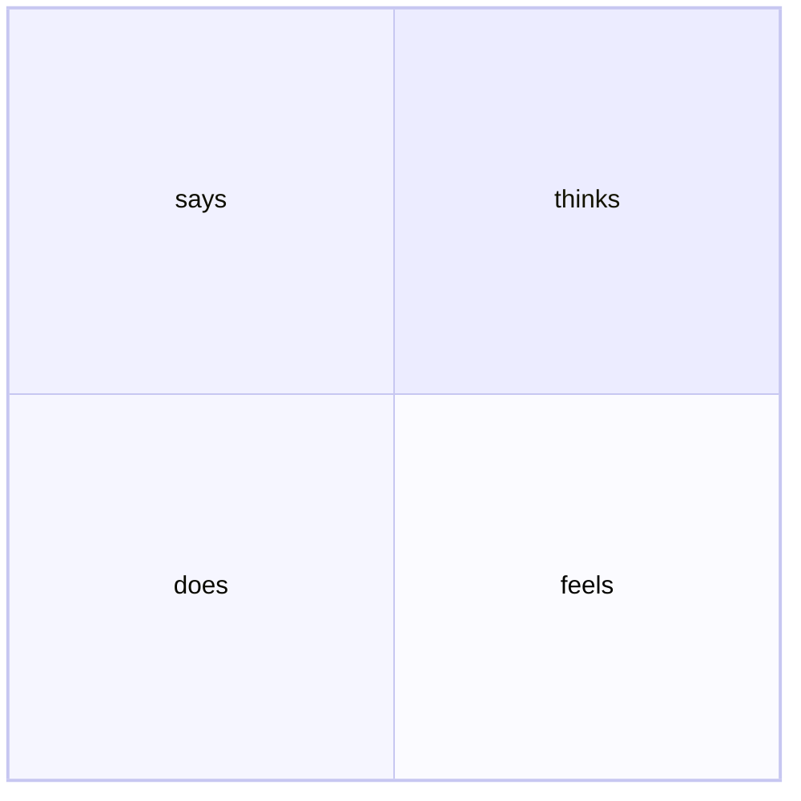

What is known about a particular type of user.
# Format

You can use stickies and a board or software.

Four quadrants with the user in the center.

- says
- does
- thinks
- feels

|says|thinks|
|:--:|:--:|
|does|feels|

# Content

## Says

- direct quotes from the user

## Does

- observations of physical actions
	- refreshes page multiple times
	- slows down to read something

## Thinks

- body language ques to the user's mental state
	- furrowed brows may indicate frustration
	- leaning towards screen may indicate difficulty

## Feels

- directly ask open ended questions about how the user feels when you notice an emotional change
	- record the user's response
